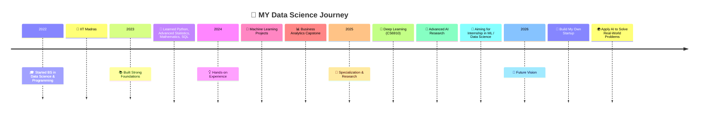

#  Hey there! I'm Ali Jawad

<div align="center">
  
  [](https://git.io/typing-svg)
  
  
  [](https://github.com/22f3001825)
  [](https://github.com/22f3001825)
  
</div>

## 🚀 About Me


```python
class AliJawad:
    def __init__(self):
        self.name = "Ali Jawad"
        self.role = "Data Science Student"
        self.university = "IIT Madras"
        self.location = "India"
        self.languages = ["Python", "JavaScript", "SQL"]
        self.interests = [
            "Machine Learning",
            "Deep Learning", 
            "Generative AI",
            "Data Analytics",
            "Full Stack Development"
        ]
        self.currently_learning = "Advanced Deep Learning (CS6910)"
        self.fun_fact = "I turn coffee into code! ☕"
    
    def say_hi(self):
        print("Thanks for dropping by! Let's connect and build something amazing together!")

me = AliJawad()
me.say_hi()
```

## 🎯 Current Focus

<div align="center">
  
| 🔬 Research | 💻 Development | 📚 Learning |
|-------------|----------------|-------------|
| Machine Learning Algorithms | Full Stack Web Apps | Deep Learning Architectures |
| Data Analytics Projects | RESTful APIs | Neural Networks |
| Predictive Modeling | Database Design | Generative AI Models |

</div>

## 🏆 Featured Projects

<div align="center">
  
<table>
  <tr>
    <td width="50%">
      <h3 align="center">🏛️ Bank Telemarketing Predictor</h3>
      <div align="center">
        <a href="https://github.com/22f3001825/Machine-learning-bank-telemarketing-success" target="_blank">
          
        </a>
        <p><strong>Machine Learning • Python • Scikit-learn</strong></p>
        <p>Advanced ML model to predict telemarketing campaign success with 78%+ accuracy using ensemble methods and feature engineering.</p>
      </div>
    </td>
    <td width="50%">
      <h3 align="center">📊 Inaya Cakezz Analytics</h3>
      <div align="center">
        <a href="https://github.com/22f3001825/BDM-CAPSTONE-PROJECT" target="_blank">
          
        </a>
        <p><strong>Business Analytics • Data Visualization • SQL</strong></p>
        <p>Comprehensive business analytics for operational insights and performance optimization.</p>
      </div>
    </td>
  </tr>
  <tr>
    <td width="50%">
      <h3 align="center">🧠 Qvizz - Smart Learning</h3>
      <div align="center">
        <a href="https://github.com/22f3001825/quiz_master_application_mad2" target="_blank">
          
        </a>
        <p><strong>Flask • Vue.js • SQLite • Redis</strong></p>
        <p>Advance exam preparation platform with great UI/UX and real-time analytics.</p>
      </div>
    </td>
    <td width="50%">
      <h3 align="center">🌟 Portfolio Website</h3>
      <div align="center">
        <a href="https://22f3001825.github.io/my_portfolio-main/ali_jawad_portfolio/" target="_blank">
          
        </a>
        <p><strong>HTML • CSS • JavaScript • Responsive Design</strong></p>
        <p>Modern, interactive portfolio showcasing projects and skills with smooth animations and mobile-first design.</p>
      </div>
    </td>
  </tr>
</table>

</div>

## 🛠️ Tech Arsenal

<div align="center">

### 👨‍💻 Programming Languages


### 🤖 AI/ML & Data Science


### 🌐 Web Development


### 🗄️ Databases & Tools


### ☁️ Cloud & Deployment


</div>

## 📊 GitHub Analytics

<div align="center">
  
  
  
  
  
  
</div>

<div align="center">
  
</div>


## 🎯 Goals & Achievements

<div align="center">

| Goal | Status | Progress |
|------|--------|----------|
| 🎓 Complete my BS Degree in Data Science | 🔄 In Progress | ████████░░ 70% |
| 🏆 Publish a Research Paper | 📝 Planning | ████░░░░░░ 40% |
| 🚀 Launch an ML SaaS Product | 💡 Ideation | ██░░░░░░░░ 20% |
| 💼 Land an Internship in ML / Data Science | 🎯 Applying & Upskilling | ██████░░░░ 70% |
| 🦄 Build My Own Startup | 🌟 Dream in Motion | █░░░░░░░░░ 10% |

</div>

## 🎓 Education and Career Journey

<div align="center">



</div>

## 🌟 What I'm Up To

<div align="center">
  
  🔭 **Currently Working On**: Advanced Neural Network Architectures for NLP  
  🌱 **Learning**: PyTorch, Transformers, MLOps  
  👯 **Looking to Collaborate**: Open Source ML Projects  
  💬 **Ask Me About**: Python, Machine Learning, Web Development  
  📫 **Reach Me**: [LinkedIn](https://linkedin.com/in/ali-jawad-9774ab339)  
  ⚡ **Fun Fact**: I debug code better after a good cup of coffee! ☕

</div>

## 🎨 Random Dev Quote

<div align="center">
  
  

</div>

## 🌐 Connect With Me

<div align="center">
  
  [](https://linkedin.com/in/ali-jawad-9774ab339)
  [](https://github.com/22f3001825)
  [](https://22f3001825.github.io/my_portfolio-main/ali_jawad_portfolio/)
  [](mailto:22f3001825@ds.study.iitm.ac.in)
  [](https://instagram.com/alien_x_019)
  
</div>

---

<div align="center">
  
  ### 💫 "Code is like humor. When you have to explain it, it's bad." - Cory House
  
  
  
  **Made by Ali Jawad**
  
  

</div>
