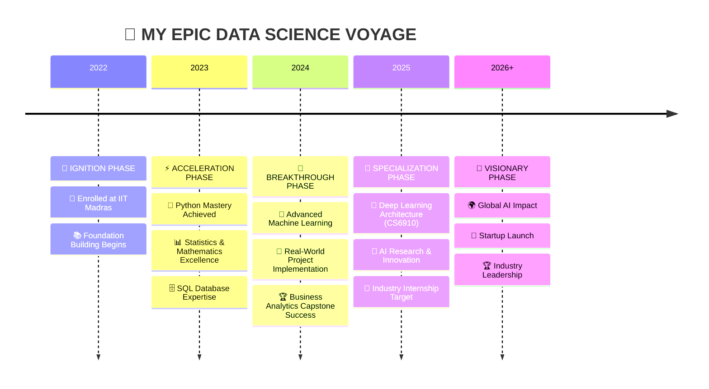

# <div align="center">🚀 **WELCOME TO MY DIGITAL UNIVERSE** 🚀</div>

<div align="center">
  
</div>

<div align="center">
  
</div>

<div align="center">
  
</div>

## <div align="center">🌟 **DIGITAL IDENTITY MATRIX** 🌟</div>

<div align="center">
<table>
<tr>
<td align="center" width="50%">

```python
class AIVisionary:
    def __init__(self):
        self.identity = {
            "name": "Ali Jawad",
            "role": "Data Science Virtuoso",
            "university": "IIT Madras",
            "mission": "Democratizing AI for Humanity",
            "superpowers": [
                "🧠 Neural Network Architect",
                "📊 Data Whisperer", 
                "🚀 Innovation Catalyst",
                "⚡ Code Alchemist"
            ]
        }
    
    def current_quest(self):
        return "Mastering Deep Learning Architectures"
    
    def life_motto(self):
        return "Turning Coffee into Intelligent Systems ☕→🤖"

# Initialize the journey
ali = AIVisionary()
print(f"🚀 {ali.identity['mission']}")
```

</td>
<td align="center" width="50%">

</td>
</tr>
</table>
</div>

## <div align="center">⚡ **LIVE STATS & ACHIEVEMENTS** ⚡</div>

<div align="center">
  
</div>

<div align="center">
<table>
<tr>
<td width="50%">

</td>
<td width="50%">

</td>
</tr>
</table>
</div>

<div align="center">

</div>

## <div align="center">🎯 **MISSION CONTROL CENTER** 🎯</div>

<div align="center">


### **CURRENT EXPEDITIONS**

| 🚀 Mission | 📊 Progress | 🎯 Status | ⏰ ETA |
|------------|-------------|-----------|---------|
| 🎓 **Data Science Mastery** |  | 🔥 **BLAZING** | Dec 2025 |
| 🧠 **Deep Learning Specialist** |  | ⚡ **ACCELERATING** | Dec 2025 |
| 📑 **Research Publication** |  | 💡 **IDEATING** | Mar 2026 |
| 🦄 **AI Startup Launch** |  | 🌱 **GERMINATING** | 2027 |

</div>

## <div align="center">🛠️ **TECHNOLOGICAL ARSENAL** 🛠️</div>

<div align="center">
<br><br>

### **🔥 CORE WEAPONS**


### **🤖 AI & ML ARSENAL**


### **🌐 WEB TECHNOLOGIES**


### **🗄️ DATA INFRASTRUCTURE**


### **☁️ CLOUD PLATFORMS**


</div>

## <div align="center">🏆 **FLAGSHIP PROJECTS SHOWCASE** 🏆</div>

<div align="center">


### **PROJECT CONSTELLATION**

<table>
<tr>
<td align="center" width="33%">

#### 🏛️ **BANK TELEMARKETING AI**
[](https://github.com/22f3001825/Machine-learning-bank-telemarketing-success)

**🎯 78%+ Accuracy Prediction Engine**
- 🧠 **Ensemble ML Algorithms**
- ⚡ **Advanced Feature Engineering** 
- 📊 **Statistical Modeling Excellence**
- 🎭 **Real-world Business Impact**

*Technologies: Python • Scikit-learn • Pandas*

</td>
<td align="center" width="33%">

#### 📊 **INAYA CAKEZZ ANALYTICS**
[](https://github.com/22f3001825/BDM-CAPSTONE-PROJECT)

**📈 Business Intelligence Platform**
- 💼 **Strategic Analytics Dashboard**
- 🔍 **Performance Optimization Engine**
- 📊 **Interactive Visualizations**
- 🎯 **ROI Enhancement Strategies**

*Technologies: Python • SQL • Tableau*

</td>
<td align="center" width="33%">

#### 🧠 **QVIZZ LEARNING NEXUS**
[](https://github.com/22f3001825/quiz_master_application_mad2)

**🎮 Gamified Education Platform**
- 🚀 **Real-time Analytics Engine**
- 🎨 **Stunning UI/UX Design**
- ⚡ **High-Performance Backend**
- 📱 **Mobile-First Architecture**

*Technologies: Flask • Vue.js • Redis*

</td>
</tr>
</table>

#### 🌟 **DIGITAL PORTFOLIO EXPERIENCE**
<div align="center">
<a href="https://22f3001825.github.io/my_portfolio-main/ali_jawad_portfolio/" target="_blank">

</a>

**✨ Immersive • Responsive • Interactive ✨**
</div>

</div>

## <div align="center">📈 **SKILL EVOLUTION MATRIX** 📈</div>

<div align="center">


### **MASTERY LEVELS**

| **Domain** | **Expertise** | **Experience** |
|------------|---------------|----------------|
| 🐍 **Python Mastery** |  | 3+ Years |
| 🤖 **Machine Learning** |  | 2+ Years |
| 📊 **Data Analytics** |  | 2+ Years |
| 🌐 **Web Development** |  | 2+ Years |
| 🧠 **Deep Learning** |  | 1+ Year |
| ☁️ **Cloud Computing** |  | 1+ Year |

</div>

## <div align="center">🎓 **ACADEMIC ODYSSEY** 🎓</div>

<div align="center">




</div>

## <div align="center">💫 **COSMIC CONNECTIONS** 💫</div>

<div align="center">


### **JOIN MY DIGITAL CONSTELLATION**

<a href="https://linkedin.com/in/ali-jawad-9774ab339" target="_blank">

</a>
<a href="https://github.com/22f3001825" target="_blank">

</a>
<a href="https://22f3001825.github.io/my_portfolio-main/ali_jawad_portfolio/" target="_blank">

</a>
<a href="mailto:22f3001825@ds.study.iitm.ac.in" target="_blank">

</a>
<a href="https://instagram.com/alien_x_019" target="_blank">

</a>

</div>

## <div align="center">🎭 **INSPIRATION MATRIX** 🎭</div>

<div align="center">


### **✨ PHILOSOPHY OF CODE ✨**

> *"First, solve the problem. Then, write the code."* - **John Johnson**
> 
> *"The best error message is the one that never shows up."* - **Thomas Fuchs**
> 
> *"Code is like humor. When you have to explain it, it's bad."* - **Cory House**

</div>

## <div align="center">🌌 **VISITOR ANALYTICS** 🌌</div>

<div align="center">


</div>

## <div align="center">⚡ **QUANTUM SNAKE** ⚡</div>

<div align="center">

</div>

---

<div align="center">


### 🚀 **"TRANSFORMING IMAGINATION INTO INTELLIGENT REALITY"** 🚀

**Ali Jawad** • *Data Science Virtuoso* • *AI Architect* • *Future Shaper*


</div>
